# Good КП

Разбор коммерческого предложения глазами клиента. Три синтетических читателя на стороне заказчика, шесть опор сильного КП, исправленная первая страница и план правок на час. Один HTML-файл, открывается в любом браузере.

Методика [Вадима Школьного](https://t.me/ShkolnyiAccount), продукт и код [Кристины Винтер](https://t.me/vintersbrain).

**Пример отчета:** скачайте [examples/stroymarket.html](examples/stroymarket.html) и откройте в браузере. КП синтетическое, компании и люди вымышлены.

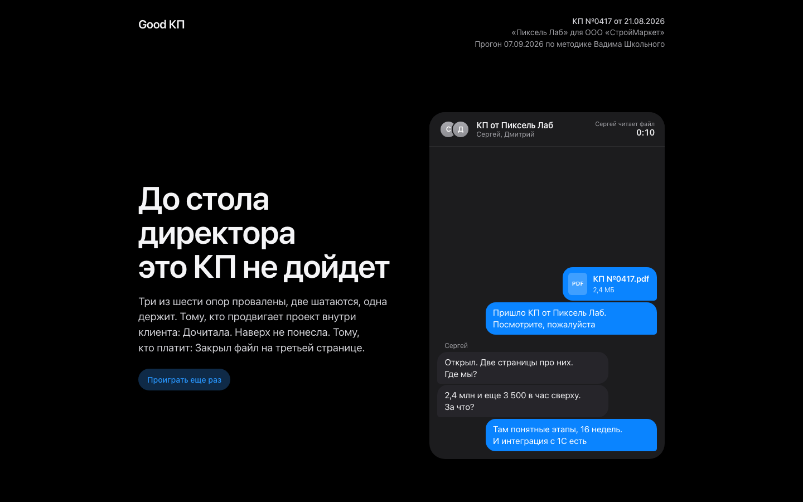

## Как пользоваться

Это скилл для Claude. Установили, дали КП, ответили на шесть вопросов, получили файл.

**Claude Code.** Клонируйте репозиторий в папку скиллов:

```bash
git clone https://github.com/cryptoyoginya/good-kp ~/.claude/skills/good-kp
```

Дальше в любом проекте: `/good-kp`, приложите КП текстом или файлом. Claude задаст шесть вопросов, соберет отчет и отдаст путь к файлу.

**claude.ai.** В настройках, раздел Skills, загрузите этот репозиторий архивом (кнопка Code, Download ZIP). В чате напишите «прогони КП» и приложите файл. Claude соберет отчет и отдаст его вложением.

**Шесть вопросов**, которые задаст Claude: клиент, проект, кто получит КП, стадия сделки, цель клиента, бюджет. Разбор опирается на них.

## Что внутри скилла

```
SKILL.md                   руководство для Claude: порядок действий
reference/methodology.md   шесть опор, три читателя, правила голоса, контракт данных
reference/example.json     полный образец отчета на синтетическом КП
assets/template.html       шаблон отчета: стили, рендер из JSON, интерактивы
scripts/build.py           проверка данных и сборка файла, только стандартная библиотека
examples/stroymarket.html  собранный пример
bot/, api/                 телеграм-бот, который выдает ссылку на репозиторий за подписку
```

Принцип один: модель возвращает только данные, весь интерфейс и все проверки живут в шаблоне и скрипте. Поэтому отчет у всех одинаковый.

Собрать отчет из готового JSON руками:

```bash
python3 scripts/build.py report.json
```

## Что внутри отчета

### Переписка внутри клиента

Первое, что видит открывший отчет: как обсуждали это КП в чате у клиента. Сообщения печатаются с паузами, как в iMessage, секундомер в шапке показывает, сколько гендир держал файл открытым. Заголовок над чатом это вердикт одной строкой.

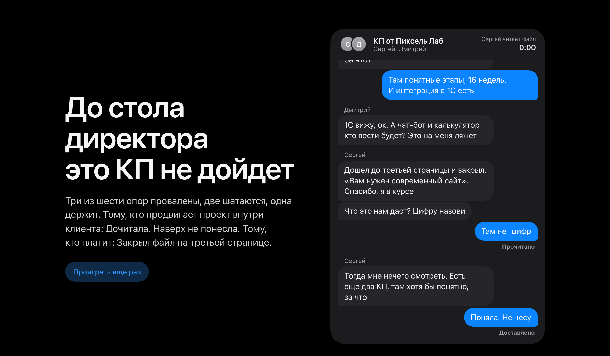

### Оглавление

Заметка со списком разделов. Пункты отмечаются по мере прокрутки, дата и время прогона по Москве.

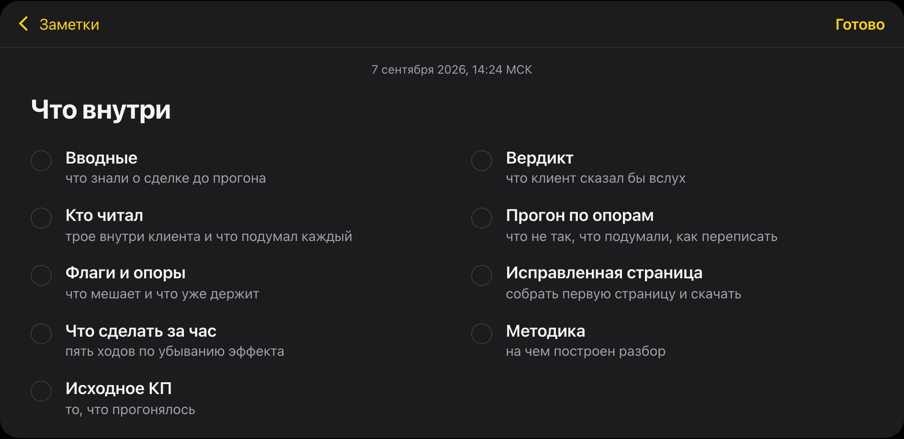

### Вводные

Шесть ответов, которые вы дали перед прогоном: клиент, проект, кто получит КП, стадия сделки, цель клиента, бюджет. Разбор опирается на них, а не на догадки.

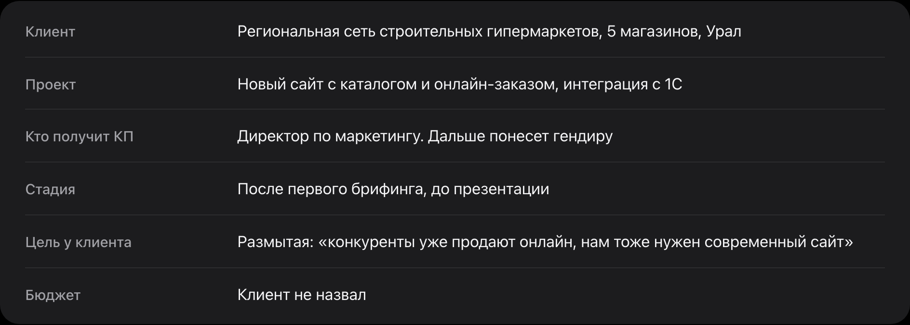

### Вердикт

Голосовое от гендира. Диктофон играет, слова подсвечиваются по ходу, перемотка на пять секунд в обе стороны. Это то, что клиент сказал бы вслух, если бы говорил честно.

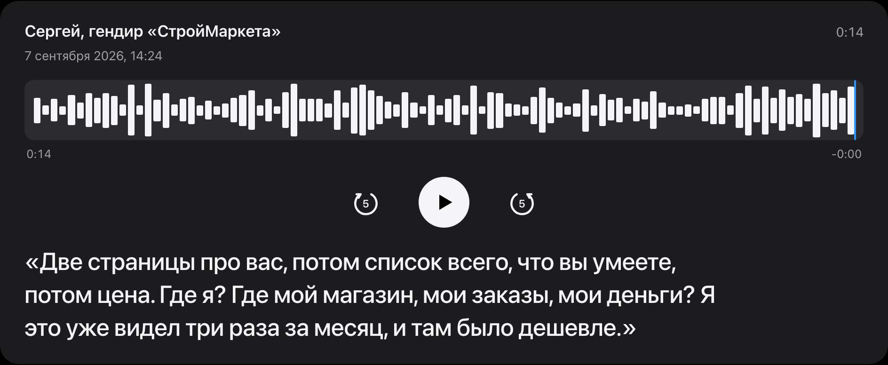

### Кто читал

Три читателя: гендир платит, инициатор продвигает проект внутри, технический исполнитель будет с этим жить. У каждого карточка: что для него важно, как он читает, чем закончил. Справа лента по шести опорам: где прочитал, где споткнулся, где закрыл файл.

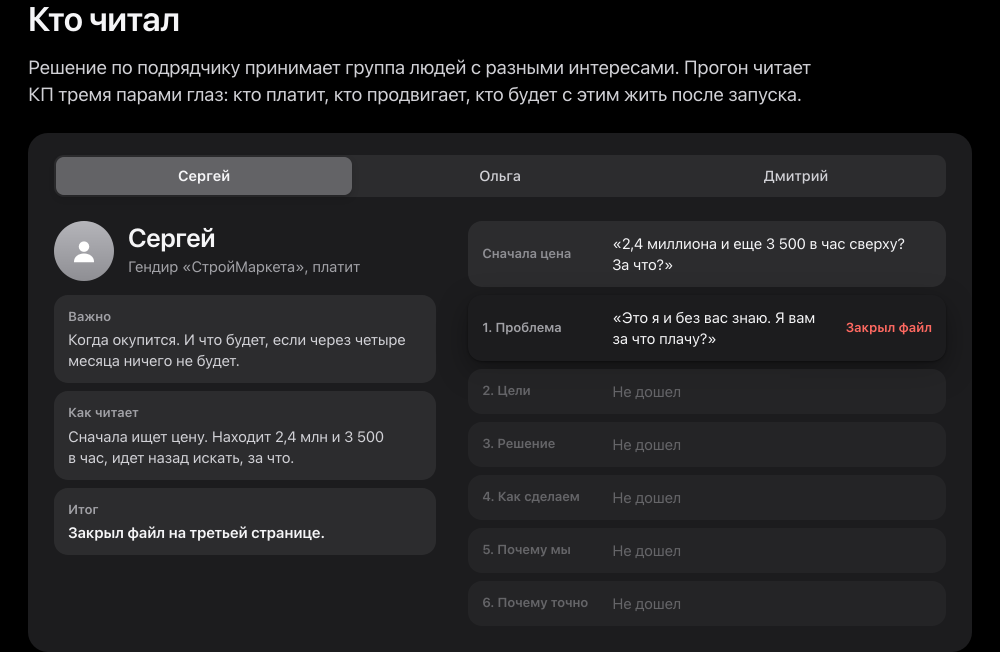

### Прогон по опорам

Шесть опор сильного КП, по каждой три состояния: прошло, споткнулся, отвалился. Внутри: цитата из КП со ссылкой на исходный абзац, почему это не работает, что делать, и переключатель «было / стало» с переписанным фрагментом. Цифры из брифинга подсвечены как плейсхолдеры.

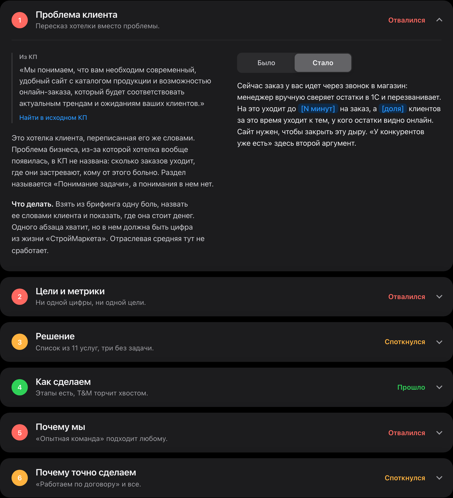

### Флаги и опоры

Экран блокировки с уведомлениями из Telegram: каждый флаг это сообщение от одного из трех читателей. Экран раскрывается по тапу, фонарик подсвечивает страницу, камера включается по-настоящему, если разрешить. Справа то, что в КП уже работает и что трогать не надо.

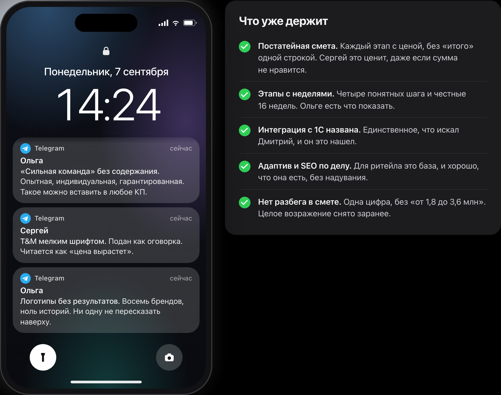

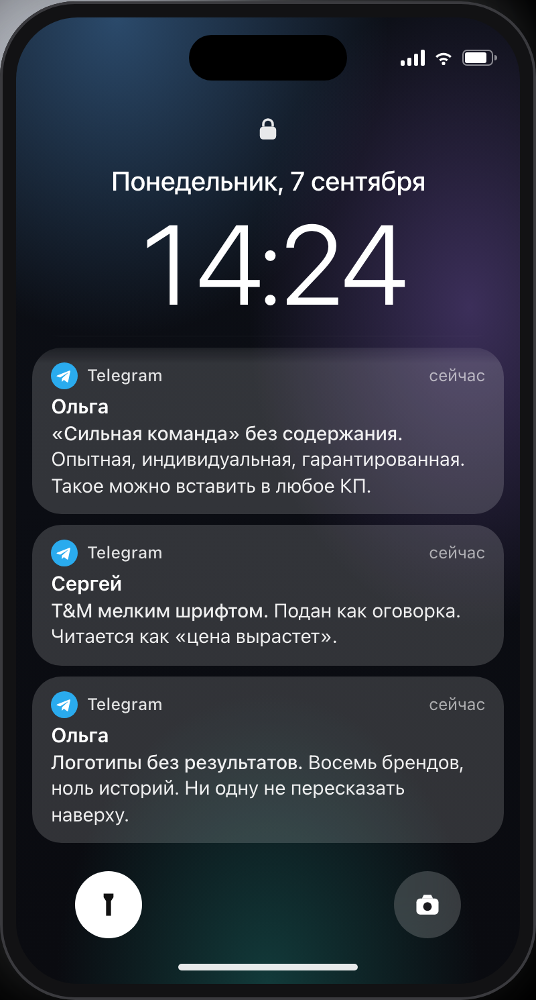

### Исправленная первая страница

Письмо в почте: шесть «стало» из разбора собраны в том порядке, в котором прочитает клиент. Сначала его проблема и цель, потом решение, потом вы. Скачивается в Word и PDF.

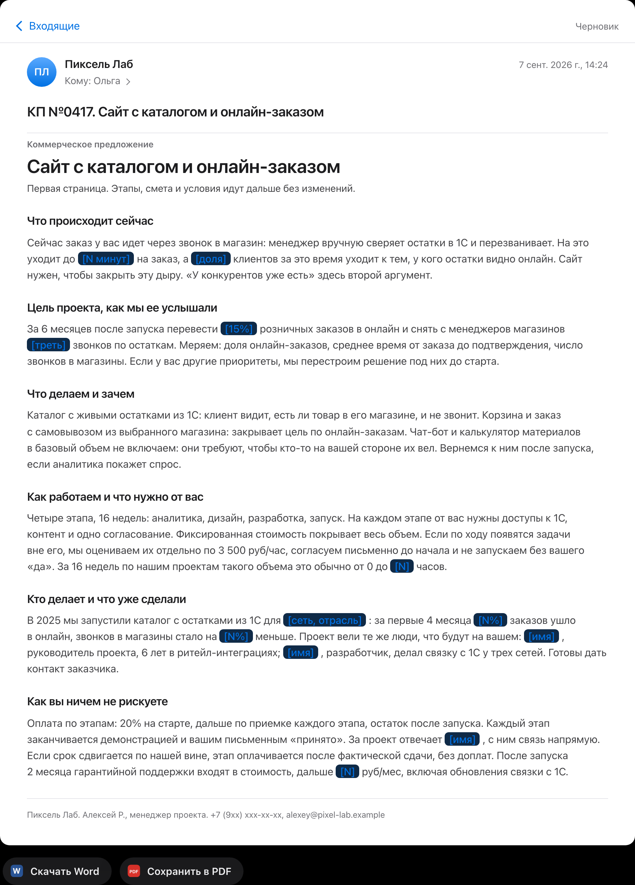

### Что сделать за час

Пять правок по убыванию эффекта, у каждой время. Таймер идет по-настоящему, кольцо размечено по правкам, текущая подсвечена.

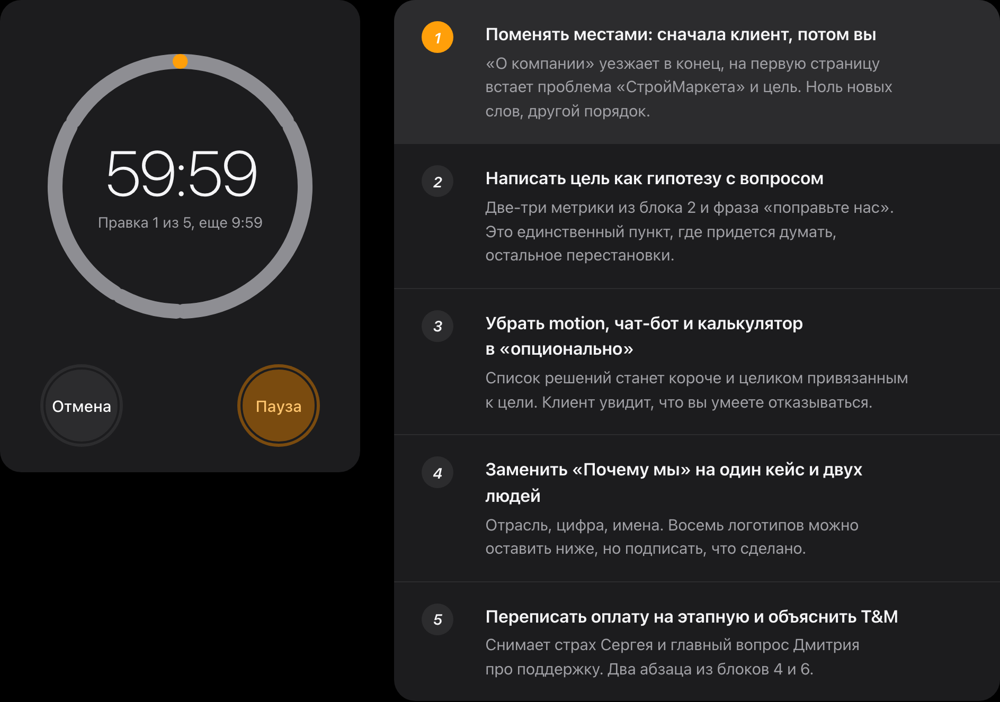

### Методика

На чем построен разбор, со ссылками на посты автора.

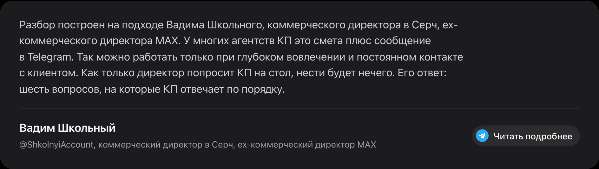

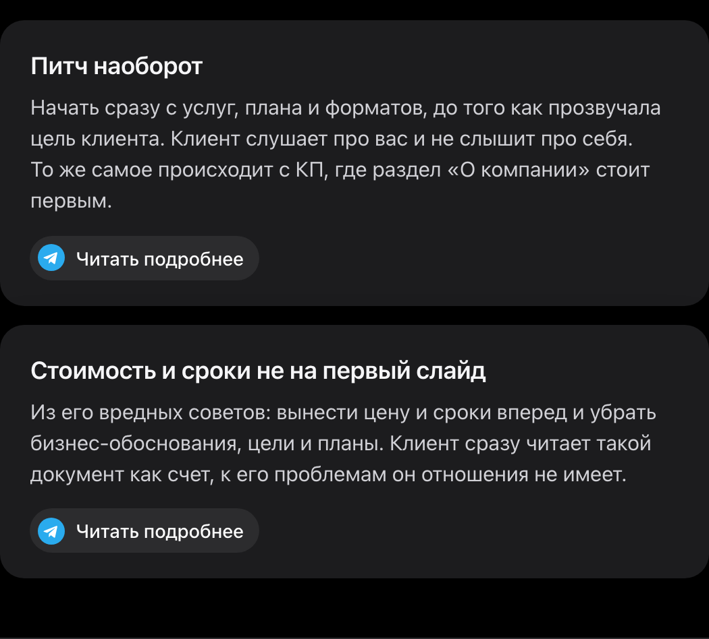

### Исходное КП

Полный текст того, что прогонялось, с якорями. Ссылки «Найти в исходном КП» из разбора ведут сюда и подсвечивают абзац.

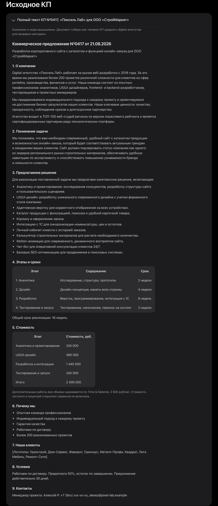

## Методика

Разбор построен на подходе Вадима Школьного, коммерческого директора в Серч, ex-коммерческого директора MAX. У многих агентств КП это смета плюс сообщение в Telegram. Так можно работать при глубоком вовлечении и постоянном контакте с клиентом. Как только директор попросит КП на стол, нести будет нечего.

### Шесть опор

Сильное КП отвечает на шесть вопросов клиента по порядку. Каждая опора в отчете получает одно из трех состояний: прошло, споткнулся, отвалился.

| | Опора | Вопрос клиента | Что проверяется |
|---|---|---|---|
| 1 | Проблема клиента | Вы поняли, что у меня болит? | Названа боль бизнеса словами клиента и где она стоит денег, а не пересказ хотелки |
| 2 | Цели и метрики | Что изменится и как мы это измерим? | Две-три измеримые цели с горизонтом, сформулированные как гипотеза с вопросом |
| 3 | Решение | Как именно это решает мою задачу? | У каждого пункта строка, что он дает. Фичи без задачи вынесены в опциональное |
| 4 | Как сделаем | Что произойдет по шагам и что нужно от меня? | Этапы, сроки, что нужно от клиента, и объяснение T&M без мелкого шрифта |
| 5 | Почему вы | Чем вы отличаетесь от двух других КП у меня на столе? | Кейс с отраслью и цифрой, люди поименно. «Опытная команда» не аргумент |
| 6 | Почему точно | Чем я рискую и как вы это снимаете? | Оплата по этапам, приемка, поддержка после запуска |

### Принципы

- **Питч наоборот.** Начать сразу с услуг, плана и форматов, до того как прозвучала цель клиента. Клиент слушает про вас и не слышит про себя. То же самое происходит с КП, где раздел «О компании» стоит первым. [Пост](https://t.me/ShkolnyiAccount/63)
- **Стоимость и сроки не на первый слайд.** Из вредных советов: вынести цену и сроки вперед и убрать бизнес-обоснования, цели и планы. Клиент сразу читает такой документ как счет. [Пост](https://t.me/ShkolnyiAccount/64)
- **Без метрики клиент покупает кота в мешке.** Если клиент не назвал ни одной метрики и цели, он покупает кота в мешке. Фичи ради фич, сайты ради сайтов. Таким клиентам автор говорит нет, и семь из десяти возвращаются уже с целью. [Пост](https://t.me/ShkolnyiAccount/21)
- **Абстрактное предложение вместо ответа.** Решение выглядит как абстрактное предложение, к задаче клиента оно не привязано. Проверка простая: у каждого пункта должна быть строка, что он дает. [Пост](https://t.me/ShkolnyiAccount/35)
- **Второе «нет»: клиентам, не знающим свою аудиторию.** «Сделайте нам продающий сайт». «А кому продаем?» «Ну, людям». Продукты и фичи запускают на аудиторию, чтобы вызвать нужное действие. [Пост](https://t.me/ShkolnyiAccount/21)
- **T&M не продают с опаской.** Главная ошибка с Time & Material в том, как его подают: с оговорками и мелким шрифтом. Клиент чувствует эту опаску и читает ее как риск. [Пост](https://t.me/ShkolnyiAccount/63)
- **Разбег в смете рождает возражение.** Оценка «от X до 2X» создает у клиента вопрос, который вы сами и подсунули. Одна цифра с понятным объемом, а то, что вне объема, отдельным механизмом. [Пост](https://t.me/ShkolnyiAccount/63)
- **«Сильная команда» это не аргумент.** Абстрактные заявления о команде оставляют клиента равнодушным. Продают кейсы с фокусом на результат. [Пост](https://t.me/ShkolnyiAccount/63)
- **Продать значит понравиться тому, кто драйвит.** Решение принимает группа: ЛПР и те, кто на него влияет. Среди них всегда есть самый активный, кто носит ваше КП коллегам. В КП должен быть материал для этого союзника. [Пост](https://t.me/ShkolnyiAccount/51)
- **После отправки не замирать.** Файл не отправляют без сопроводительного слова, после отправки напоминают о себе новой ценностью, а если выбрали не вас, спрашивают почему. [Пост](https://t.me/ShkolnyiAccount/64)

## Бот доступа

Телеграм бот @goodkpbot закрывает доступ к репозиторию подпиской на два
канала. На `/start` или любое сообщение он проверяет через `getChatMember`,
подписан ли пользователь на оба канала. Если да, присылает ссылку на
репозиторий и короткую инструкцию, как начать. Если нет, называет каких
каналов не хватает и показывает кнопки для подписки и «Проверить снова».
Бот не хранит состояние: каждая проверка идет напрямую в Telegram API.

Переменные окружения (`.env`, не коммитится):

- `BOT_TOKEN` токен бота из BotFather
- `CHANNELS` через запятую, без `@` (по умолчанию `vintersbrain,ShkolnyiAccount`)
- `REPO_URL` ссылка, которую бот присылает после проверки
- `WEBHOOK_SECRET` опционально, секрет для заголовка вебхука

Локальный запуск (long polling, без Vercel):

```bash
uv run python bot/poll.py
```

Развертывание на Vercel (вебхук, `api/webhook.py`):

```bash
vercel env add BOT_TOKEN
vercel env add CHANNELS
vercel env add REPO_URL
vercel env add WEBHOOK_SECRET
vercel deploy --prod
curl "https://api.telegram.org/bot<токен>/setWebhook?url=https://<app>.vercel.app/api/webhook&secret_token=<секрет>"
```

Обязательное условие: @goodkpbot должен быть администратором в обоих
каналах. Без прав администратора Telegram отвечает на `getChatMember`
ошибкой «member list is inaccessible», и бот сообщает об этом пользователю
как о проблеме конфигурации, а не как об отсутствии подписки.

## Что дальше

CLI: чтение pdf, docx и pptx, вызов модели по схеме, типографский проход, сборка отчета одной командой.

## Авторы

Методика: Вадим Школьный, коммерческий директор в Серч, ex-коммерческий директор MAX, [@ShkolnyiAccount](https://t.me/ShkolnyiAccount).

Продукт и код: Кристина Винтер, [@vintersbrain](https://t.me/vintersbrain).
